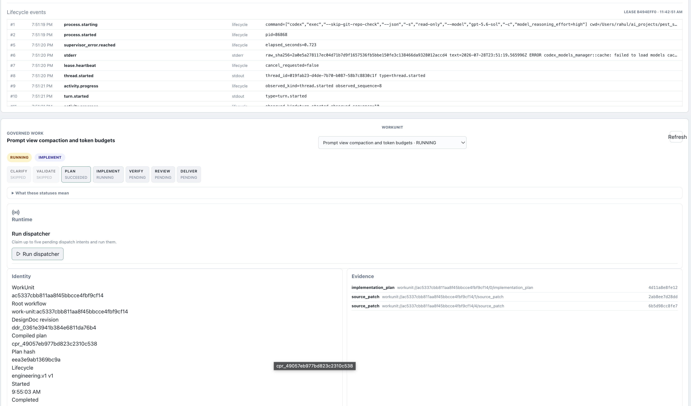
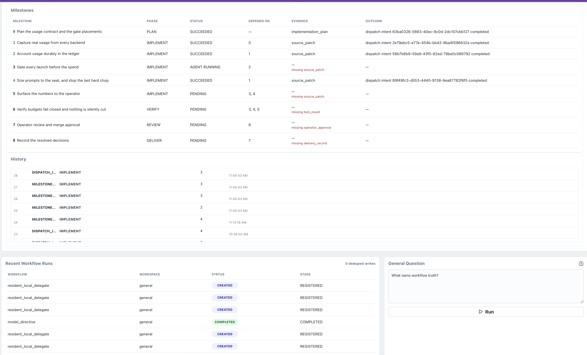

# aidashos

This is a production-grade prompt builder for projects. You write a design document. The system compiles it into a fixed plan using AI and runs coding agents against that plan. This all happens on your machine, with any combination of ai agents you can provide via subscription. This repository is the whole product.

## How
The core system design of this project is durable orchestration of coding agents on your own machine. Your "compiled" design plan is worked on in isolated git worktrees. Each agent verifies its output with your project's own test commands, has a different vendor's agent review the work that was done, and stops at a human approval gate before anything merges.

## Start here

Two commands, in this order:

```bash
git clone https://github.com/rahul-nath/aidashos.git && cd aidashos && make
./scripts/boot/boot.sh
```

`make` is the base install: uv, Python 3.13, Node, Docker, Postgres, and the schemas.
`./scripts/boot/boot.sh` is the boot sequence: llama.cpp, the model weights, both subscription sign-ins, the default stack config, and a final readiness check that prints the fixing command for anything missing.
macOS is the supported platform; Linux is expected to work and is not exercised on a schedule.
Windows is not supported yet.

The whole path, start to finish, is [docs/onboarding/ONBOARDING.md](docs/onboarding/ONBOARDING.md), drawn as a DAG in [docs/diagrams/aidashos-onboarding-dag.png](docs/diagrams/aidashos-onboarding-dag.png).
Stuck at any point, `./scripts/first-run-check.sh` says what is missing and prints the command that fixes it.

## Let an agent install it

Paste [docs/onboarding/BOOT_PROMPT.md](docs/onboarding/BOOT_PROMPT.md) into Claude Code, Codex, or any AI tool with shell access, opened at the repo root.
It drives the same scripts, one stage at a time so a failure is visible and fixable, and hands the two subscription sign-ins and the large model downloads back to you rather than deciding them for you.

Three prompts run the whole lane: boot the stack, start the runtime and prove it, attach your own tool.
All three live in [docs/onboarding/prompts.json](docs/onboarding/prompts.json), which is the single source for them.
The walkthrough quotes that file and the website renders it, so a test (`tests/test_onboarding_prompts.py`) pins all three together and to the scripts they name.
Nothing here can tell you to run a script this repository does not ship.

## Drive it from the AI tool you already use

The coordination ledger is an MCP server, so the system is operable from your daily driver rather than only from its own terminal.

```bash
uv run agent-ledger serve      # stdio MCP, from the repo root
```

Claude Code needs no setup at all: the repo ships [.mcp.json](.mcp.json), so opening a session at the root offers the `agent-os` server.
Codex and any other stdio MCP client get their config block from [skills/operate-agent-os/SKILL.md](skills/operate-agent-os/SKILL.md), which also carries the operating ritual: what to check first, how to drive the workflows, and which boundaries an assistant does not cross.

`run_first_run_check` is there too, for clients with no shell of their own.
It is an adapter over `scripts/first-run-check.sh` rather than a second copy of the readiness rules, so it cannot drift from what the script says.

A dispatched agent inside the system gets a different, deliberately smaller surface: three read-only tools, and no way to file evidence about its own run.

The rest of this README is what the system actually does.

Every step writes a row to a local Postgres ledger as it happens, which is what makes it survivable: close the laptop mid-run and the next dispatch picks up from what the ledger says.

Frontier agents (Claude Code and Codex today, swappable in config) run through their own headless CLIs under your existing subscriptions.
Local models run through llama.cpp.
There is no hosted service, no cloud backend, and nothing reports home.

## Who this is for

One engineer who runs coding agents and wants the work to keep moving, accountably, when nobody is watching a screen.

You drive it from a terminal, with a web console alongside for reading state and resolving approval gates.
You should be comfortable with git, Docker, and editing a TOML file.
It is a working personal system rather than a product, and if you do not write code it is not aimed at you yet.

Interactive agent cockpits are better when you are watching the screen.
This is built for the other half of the problem: agent work that runs unattended, repeatedly, and leaves an audit trail.

## What it does, concretely

Work starts from a document, not a prompt.
The document declares goals, milestones, dependencies between them, how each one is verified, and what the agents are permitted to do.
[docs/examples/work_unit_acceptance_design_doc.md](docs/examples/work_unit_acceptance_design_doc.md) is a real one the test suite compiles, and it is this short:

```markdown
## Milestone B: implement the reader

Phase: IMPLEMENT
Depends on: A
Acceptance: the reader lands
Artifacts: source_patch
```

That compiles into an immutable, hashed plan.
Then:

```bash
pi /start /new-project --target-project-id my_project   # author the document
pi /approve-most-recent                                 # review the plan, permissions, and gates
pi /dispatch                                            # claim one milestone and run it
pi /ledger                                              # inspect sagas, tasks, approvals
```

`pi /dispatch` claims at most one pending dispatch intent, the oldest, with `LIMIT 1 FOR UPDATE SKIP LOCKED` so several dispatchers cannot double-run one piece of work.
`/start /dispatcher --max-polls N` is the form that takes a poll count.
For that one milestone it builds the typed task graph, collects a local-model context turn, runs the senior agent in an isolated worktree, runs verification, checkpoints the exact branch, base, and commit, and starts staff review.
A staff BLOCK triggers a bounded revision and re-review loop.
Staff approval stops at a pending `CODE_MERGE` request.
It never merges, deploys, or completes a milestone on its own.

Work is routed to three tiers.
Junior is a local model making the cheap judgment calls, senior is the frontier agent that writes code, and staff is a frontier agent from a different vendor that reviews it.

A **cast** is the other shape a dispatch can take, and it varies stance instead of seniority.
It runs several roles concurrently on one question, each told to hold its stance rather than pre-compromise, and reduces them with a synthesizer that names the disagreements before resolving them.
A member's role is also its `POLICIES.md` principal, since the capability gate resolves a role to a policy section before falling back to the seat, so per-stance privileges are a markdown section rather than a code change.

The default cast seats every stance on the junior tier today, which measures one model's prior three times rather than three architectures.
A tier names a seat rather than a model: `configs/staffing.toml` decides which harness and which model sit in each seat, and swapping one is a one-line edit with no code change.
As staffed today that is Codex implementing and Claude Code reviewing; `configs/staffing.toml` is the one place that says so, and swapping it is a one-line edit.
The two seats are never the same vendor, so the reviewer does not share the implementer's blind spots.

## Is there a UI, or is it terminal only?

Three ways in, and the terminal is primary.
`pi` drives the workflows and `agent-ledger` reads the ledger.

The third is your own AI tool.
The coordination ledger is an MCP server (`uv run agent-ledger serve`), so Claude Code, Codex, or any stdio MCP client can operate the system from the tool you already work in.
Claude Code picks up the repo's `.mcp.json` with no setup; [skills/operate-agent-os/SKILL.md](skills/operate-agent-os/SKILL.md) carries the Codex config block and the operating ritual, including which boundaries an assistant does not cross.
A dispatched agent inside the system gets a different, read-only surface: three tools and no way to file evidence about its own run.

A React cockpit at `http://127.0.0.1:8000` shows work units, milestones, events, artifacts, and pending approvals.




It writes exactly one thing: an approval decision.
`web/src/workunits/WorkUnitCockpit.tsx` renders Approve and Deny buttons that POST to `/work-units/{work_unit_id}/decisions`, and the result is recorded as a ledger approval like any other, attributed to `cockpit`.
That is the only write the client makes.
It never merges, deploys, or skips a gate, and for anything past resolving a gate it prints the authoritative next command instead of running it.

## Is it durable? Can I shut the laptop and come back?

Yes, and that is the design's whole bet.

Work state lives in Postgres rows rather than in context windows: work units, milestones, dispatch intents, execution leases, checkpoints, and approvals.
The background loops that drain queues and claim work are supervised, so a reboot comes back with the queue draining rather than with every service healthy and nothing moving.
An agent process that dies with the lid loses only its own context window.
The crash reconciler reaps its dead lease, and the next dispatch resumes from the ledger.

Closing the laptop mid-run costs that attempt's uncommitted progress, never the system's state.

## What data store backs it? Not SQLite?

Postgres, running locally in Docker.
The coordination ledger, the durable workflow engine (DBOS), and the retrieval vectors (pgvector) all live there.

SQLite is not an operator ledger, and it cannot become one by configuration.
The coordination ledger's connection pool is Postgres-only (`coordination/store.py`), so no environment variable points it at a file.

The SQLAlchemy layer is the softer half: `db.py` still builds a SQLite engine if `LOCAL_AGENT_DATABASE_URL` names one, and the vector columns degrade from `halfvec` to plain JSON when it does.
That path exists for the test suite.
Nothing shipped is pointed at it, and no config, compose file, or `.env.example` line names a SQLite URL.

## Does it run remotely? Is it containerized?

It runs on your machine, on purpose.

Postgres and the optional observability stack run in Docker.
The local model server and the frontier CLIs run as host processes, because the model wants your GPU and the CLIs want your logged-in subscriptions.
A compose profile (`app`) and the Kind manifests under `k8s/` can run the application itself in a container, but the supported everyday mode is the host.

The only network dependency is the frontier tiers calling their vendors' models through their own CLIs, under your accounts.
The junior tier and the entire control plane run with the network unplugged.

The system is instrumented, and all of it points at your own machine.
The API serves Prometheus metrics at `/metrics`, and `observability/` brings up Loki, Tempo, Prometheus, Pyroscope, and Grafana as local compose services.
OpenTelemetry traces (`LOCAL_AGENT_OTEL_TRACES_ENABLED`) and continuous profiling (`LOCAL_AGENT_PYROSCOPE_ENABLED`) are both off by default on the host, and both default to a `127.0.0.1` endpoint when you turn them on.
The containerized `app` compose profile turns both on and points them at the Alloy and Pyroscope services inside the same stack.
Nothing is collected by the author or by any vendor.
If you want traces on a remote collector, `LOCAL_AGENT_OTEL_TRACES_ENDPOINT` and `LOCAL_AGENT_OTEL_TRACES_HEADERS` are how you send them there, and that is your decision to make rather than a default to discover.

## Quick start

Requirements are macOS or Linux, Git, Python 3.13, Node 22.19+, Docker, and a local model you can serve.
The two commands at the top of this file are the whole install; the steps below are what they run, for when you would rather drive each one yourself.

```bash
./scripts/first-run-check.sh             # what is missing, and the command that fixes each miss
./scripts/bootstrap.sh --install-system  # what `make` runs
./scripts/boot/boot.sh --skip-models     # llama.cpp, logins, stack config, verification
./scripts/download-models.sh --list      # inspect model sources; nothing downloads automatically
./scripts/download-models.sh gemma4
./scripts/start-agent-runtime.sh         # Postgres, llama.cpp, ASR, and the resident pi daemon
```

`first-run-check.sh` reports the toolchain, the ledger, the junior model, each frontier subscription, every registered target project, and who owns the resident loops.
It changes nothing and exits non-zero when something would stop a governed run, so it also works as a preflight in a script.
Each boot stage is documented in [scripts/boot/README.md](scripts/boot/README.md) and is idempotent, so any one of them can be re-run alone.

For the cockpit:

```bash
cd web && npm ci && npm run build && cd ..
uv run local-agent serve                 # http://127.0.0.1:8000
```

Target projects are registered in `configs/linked_projects.toml`, which ships with example entries describing no real machine.
Replace them with your own before dispatching anything.
Configuration is documented in [docs/configuration.md](docs/configuration.md), which is generated from the settings model rather than hand-written.

### A served local model is required

This is the one dependency the project will not run without, and that is the point of it rather than a limitation.

The junior tier proposes a lifecycle phase for a milestone whose document declared none, and `work_units/phase_classifier.py` is careful about it: the proposal carries confidence and reasoning, is stamped `inferred=True` so it cannot be mistaken for a declaration, and blocks the compile below the confidence threshold rather than guessing.
It assesses whether a stalled frontier process is still making progress, after the deterministic supervisor detects the stall rather than in place of it.
It returns the checkpoint verdict, which `_checkpoint_review_json` fails closed on when the output is not valid JSON.

Those are decisions the system makes *about* the frontier agents.
A build that made them by calling somebody's API would be an agent OS that cannot think without the network.

One model is enough.
A machine with a local model and no frontier subscription is supported: staff every tier locally in `configs/staffing.toml` and the governed pipeline still runs end to end.
That is not a claim on paper.
`tests/test_work_unit_golden_path.py` drives a design document to SUCCEEDED with junior, senior, and staff all staffed on the local harness, through the same resident loops `scripts/start-agent-runtime.sh` starts, as real subprocesses.
Run that lane with `LOCAL_AGENT_RUN_POSTGRES_INTEGRATION=1`.

The reverse is not supported.
A machine with frontier subscriptions and no local model is missing the half of the system that decides what the subscriptions are allowed to do.

## What a fresh clone can and cannot do

**Works with nothing but the repo and `uv`:** the compiler from a design document to a hashed execution plan, the lifecycle state machine, and every scheduling decision.
Those are pure and offline.

**Needs Docker:** the full test suite, the coordination ledger, dispatch intents, approvals, and the durable workflow engine.
The suite runs against real Postgres rather than a mock, and starts its own `postgres-test` compose service on port 5433 to get one.

**Needs model weights you download deliberately:** anything on the junior tier.

**Needs your own frontier subscriptions:** senior implementation and staff review.
Without them you can still run local queries and junior-only delegated work, but not the governed coding pipeline.

**Deliberately unfinished:** training export and audio egress are stubs, the cockpit is read-only and secondary to the terminal, the intake path and the work-unit execution path are still converging, and the whole system assumes a single operator.

## Tests

```bash
uv run pytest
uv run ruff check
uv run pyright
```

That command is the validation claim.
A test count printed here would be stale within weeks, and a command you can run beats a number you have to trust.
Every test gets a fresh schema on the test server, so `uv run pytest` never writes to the runtime ledger.

Read [skills/agent-startup/SKILL.md](skills/agent-startup/SKILL.md) before contributing non-trivial changes.
It is the same ritual the agents follow.

## Safety notes

- No auto-merge, auto-deploy, spend, secret access, or external communications. These fail closed behind ledger approval requests.
- Agent processes never get ambient shell, raw HTTP, delete, or arbitrary file access. Real-world tool actions run only through an operator allow-list (`configs/workspace_policies.toml`).
- [POLICIES.md](POLICIES.md) is the written policy the capability gate reads at runtime, and its content hash is pinned in code.

## License

Copyright (C) 2026 rahul-nath.

This program is free software: you can redistribute it and/or modify it under the terms of the GNU Affero General Public License as published by the Free Software Foundation, either version 3 of the License, or (at your option) any later version.

This program is distributed in the hope that it will be useful, but WITHOUT ANY WARRANTY; without even the implied warranty of MERCHANTABILITY or FITNESS FOR A PARTICULAR PURPOSE.
See the GNU Affero General Public License for more details.
