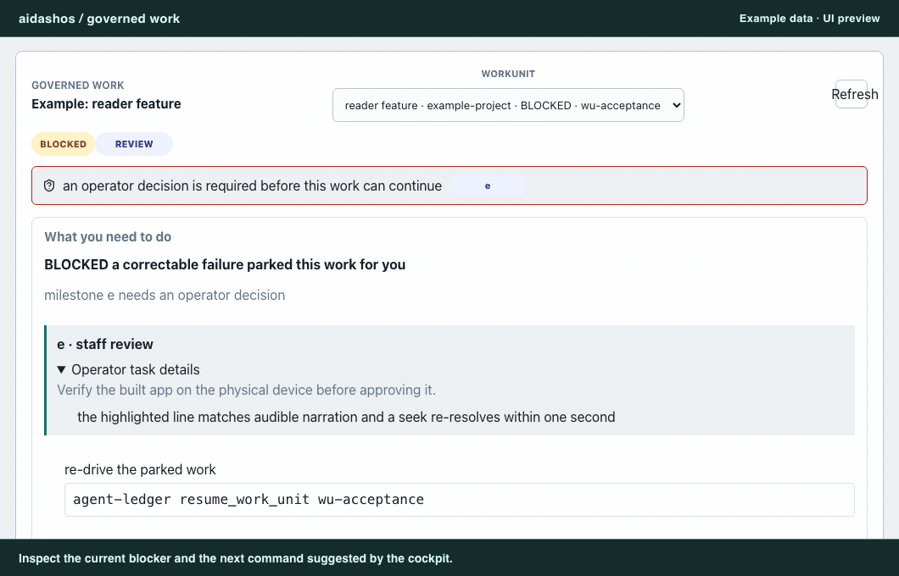

<div align="center">
  
  <h1>aidashos</h1>
  <p><strong>Make Plans, Not Prompts</strong></p>
  <p>Give your coding agent a plan.<br />Keep the work, tests, reviews and approvals in one local record.</p>
  <p>
    <a href="https://aidashos.com/">Website</a> ·
    <a href="#get-started">Get started</a> ·
    <a href="#documentation">Docs</a> ·
    <a href="https://github.com/rahul-nath/aidashos/issues">Report a bug</a>
  </p>
  <p>
    <a href="#get-started"></a>
    <a href="LICENSE"></a>
  </p>
  <p><strong>Snapshot validation · September 12, 2026</strong></p>
  <p>
    <a href="#validation"></a>
    <a href="#validation"></a>
    <a href="#validation"></a>
  </p>
</div>



*Cockpit preview using example data from the browser tests, not a recording of a live agent run. [Static preview](docs/media/readme/cockpit-preview.png).*

## Keep the work beyond the chat

Use aidashos when a task needs several steps, separate review, human approval or evidence that must survive the current session.
Your agent drives the workflow; you can inspect what happened, what is blocked and what needs your decision.
For a small, bounded edit, a direct pass with your coding agent is still enough.

| Plan the work | Inspect the work | Decide what lands |
| --- | --- | --- |
| Save a fixed plan with steps and permissions | Keep implementation in a separate Git worktree | Review test results and a separate AI review |
| Track each milestone and attempt | Read the recorded status and blocking reason | Approve the exact change before integration |

## Get started

**macOS is the supported platform.**
This is a developer preview; the contained verifier uses macOS-specific security features.

### Start through your coding agent

Give your local coding agent the [setup prompts](https://aidashos.com/quickstart/).
They walk through the same installation scripts, provider sign-ins and local-model setup as the terminal path.

Once setup is complete, paste this into your agent:

```text
Use aidashos for this task.
Read skills/operate-agent-os/SKILL.md in my aidashos checkout.
Check that the system is ready, help me write a plan with clear tests,
and show me the plan and required permissions before starting work.
```

Claude Code can discover the connection through the included `.mcp.json` file.
The [operator guide](skills/operate-agent-os/SKILL.md) includes connection instructions for Codex and other compatible clients.

<details>
<summary><strong>Set up from the terminal</strong></summary>

```bash
git clone https://github.com/rahul-nath/aidashos.git
cd aidashos
make
./scripts/boot/boot.sh
```

Setup installs tools and a local database, then walks you through local-model downloads and provider sign-ins.
The macOS verifier also needs administrator-approved installation and checks on your machine.
Follow the [full onboarding guide](docs/onboarding/ONBOARDING.md) and [verifier setup](scripts/verifier_uid/README.md) before starting work.
This release does not promise a working Linux or Windows setup.

</details>

## From an idea to an approved change

Say you want to add a search box to an app:

1. **Describe the result.** Ask your agent to write down what the search box should do, what it must leave alone and how to test it.
2. **Approve the plan.** Inspect the saved steps and permissions before work starts.
3. **Implement separately.** The agent edits a Git *worktree*, a separate working copy that leaves your main branch alone.
4. **Check the evidence.** Run the project's test commands and use a separate AI session to review the exact change.
5. **Approve the merge.** Inspect the proposed change and its evidence before integration.
6. **Keep the result.** Trace the delivered change back to its plan, attempts, tests, review and approval.

Your agent can help author the structured design document, called a **CGD**.
The compiled plan becomes a **WorkUnit** with smaller steps called *milestones*.
The [worked example](docs/work_unit_operator_walkthrough.md) follows that path in detail.

<details>
<summary><strong>What happens when work stops?</strong></summary>

If a test fails, a model is unavailable or an approval is missing, your agent can read the saved blocker and help you choose the next action.
Recovery can require your input; recorded work does not imply automatic recovery from every failure.

The history lives in PostgreSQL on your computer, so ending a chat or restarting the runtime does not erase recorded work.
Your computer still needs to be awake, with the required services available, for agents to keep working.
Keep backups of the database and your repositories.

</details>

## Models and provider accounts

In the default setup, that is Codex implementing and Codex reviewing in separate sessions.
Claude Code is available as a fallback.
These use your existing provider sign-ins and subscription limits.
Local models handle smaller decisions; the whole implementation-and-review workflow cannot yet run on local models alone.

## Validation

The green badges describe the **September 12 public snapshot**, published as [`55bde9d`](https://github.com/rahul-nath/aidashos/commit/55bde9d7ad4490c88e606502b54266557f1aa06c).
They are dated validation results, not live GitHub Actions status.
The [public release record in PR #8](https://github.com/rahul-nath/aidashos/pull/8) identifies the tested candidate and results.

| Check | Recorded result |
| --- | --- |
| `uv run pytest` | 3,186 passed, 218 skipped; one dependency deprecation warning |
| `uv run ruff check` | Passed |
| `uv run pyright` | Zero errors and zero warnings |
| Dashboard and website production builds | Passed |

The full contained gate completed within its 3,600-second budget using already-installed dependencies and a disposable test database.
Skipped cases include opt-in host checks and private-repository documentation checks.
This does not establish a fresh-machine installation or a new live-agent run from a public clone.

## Documentation

| I want to… | Start here |
| --- | --- |
| Set up my machine | [Quickstart](https://aidashos.com/quickstart/) · [Full onboarding](docs/onboarding/ONBOARDING.md) |
| Connect and operate through my agent | [Operator skill](skills/operate-agent-os/SKILL.md) · [Agent manual](docs/AGENT_MANUAL.md) |
| Understand a complete task | [WorkUnit walkthrough](docs/work_unit_operator_walkthrough.md) · [Example plans](docs/examples) |
| Inspect work and approvals | [Cockpit runbook](docs/cockpit_e2e_runbook.md) |
| Configure or understand the runtime | [Configuration](docs/configuration.md) · [Code structure](docs/code_structure.md) |

## Status and license

Aidashos is a public developer preview.
Read proposed changes before approving them and [report problems](https://github.com/rahul-nath/aidashos/issues).
Track open work in the [issue tracker](https://github.com/rahul-nath/aidashos/issues), including [model-availability wakeup](https://github.com/rahul-nath/aidashos/issues/4) and [stronger plan validation](https://github.com/rahul-nath/aidashos/issues/7).

Licensed under [AGPL-3.0-or-later](LICENSE).
